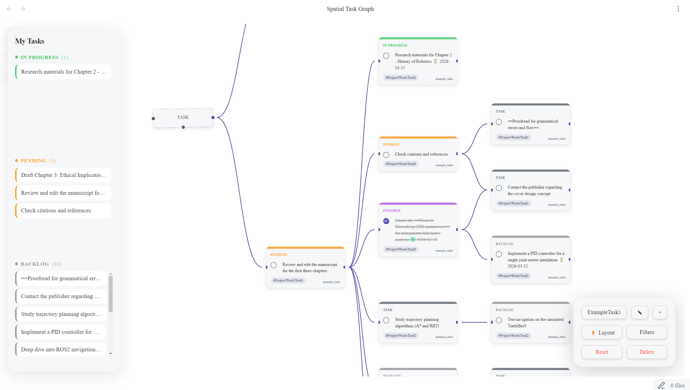
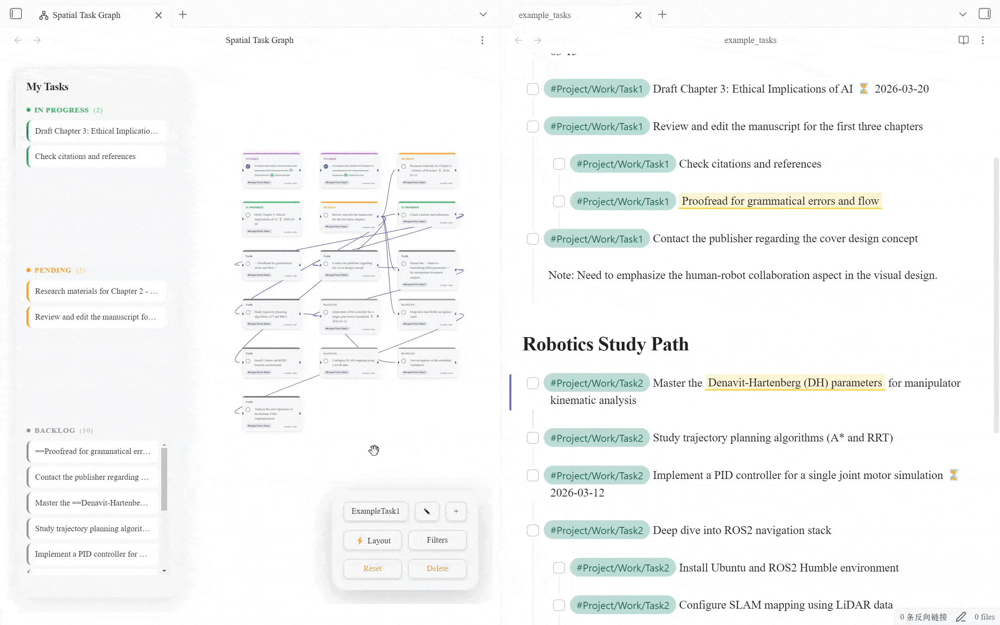
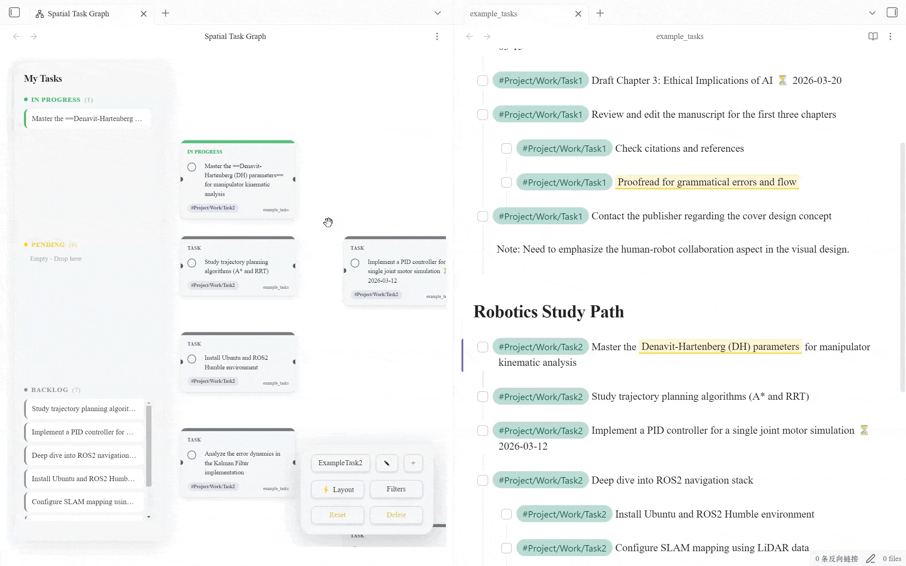
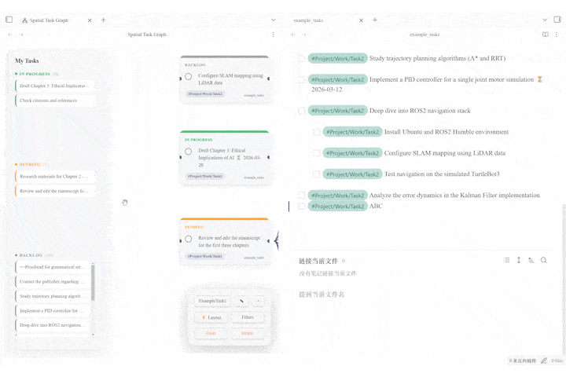
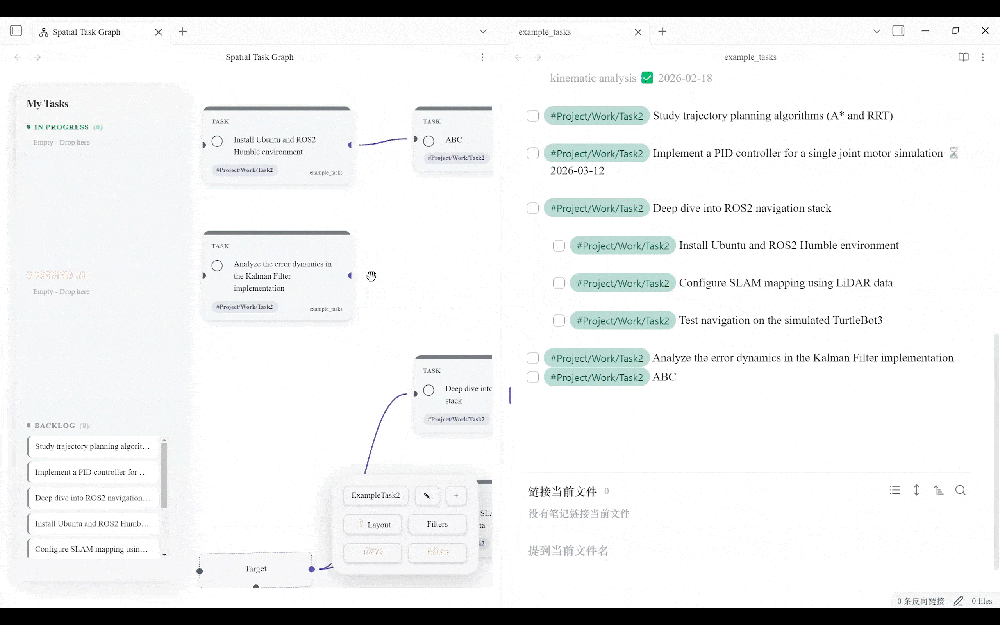
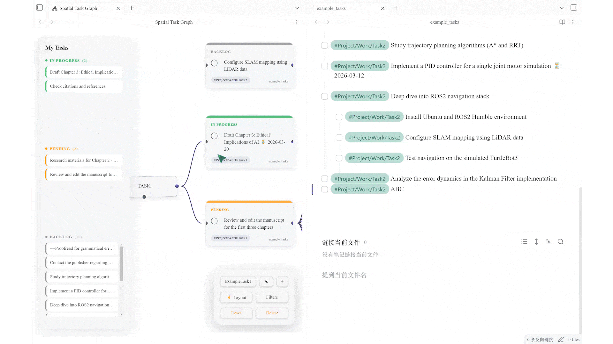
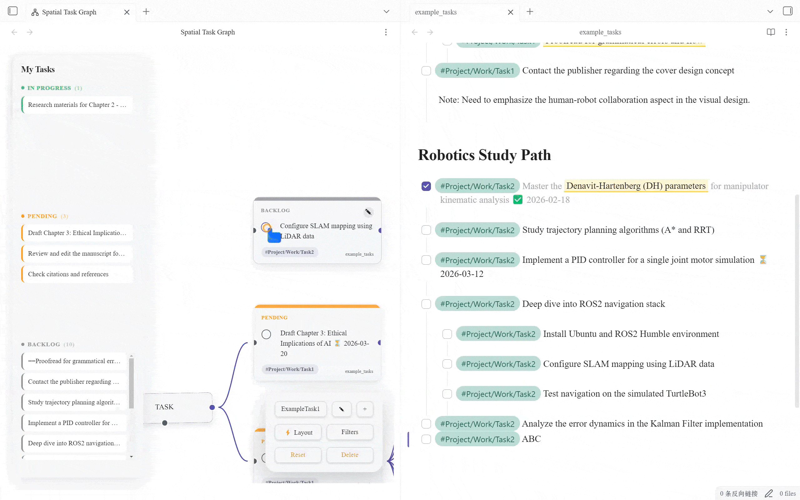

# Spatial Task Graph

Spatial Task Graph transforms your linear markdown tasks into a dynamic, interactive infinite canvas. Visualize dependencies, manage workflows with a Kanban-style sidebar, and organize your thoughts spatially—all with a premium Apple-style aesthetic.

*(Above: A preview of the Spatial Task Graph infinite canvas and control HUD)*

## ✨ Key Features

### 1. Smart Layout & Organization
Automatically organize your messy graph with a single click. The intelligent layout algorithm centers parent nodes and sinks completed, isolated tasks to the bottom to keep your view clean.

### 2. Intuitive Graph Interactions
Manage your tasks spatially with fluid mouse gestures.

* **Connect & Edit:** Drag to connect tasks. Right-click connections to delete them.
    
* **Text Notes:** Right-click on the canvas to add sticky notes for context or headers.
    
* **Batch Move:** Hold Left Click to box-select multiple nodes and move them as a group.

### Nested task groups

* Select a task and press **Ctrl+A** (**Cmd+A** on macOS) to select its tree. Hold **Shift** and select nodes to add to the selection.
* Select at least two connected objects at the same level, then choose **Create group**. Each object belongs to one parent group; whole groups can be nested.
* A member task cannot be placed in another group while it belongs to a group. Select the existing group frame itself to nest the complete group inside a larger group.
* Tasks inside expanded groups remain individually selectable and movable. Folding a parent task keeps its task card and child checklist inside an automatically named group frame.
* Drag a group title to move its members together. Collapse it to show a nested task checklist, or double-click its title to enter the group. Use **Back** to return to the previous level.
* Connect a group directly to another task or group without expanding it. Existing task connections keep their original endpoints when the group is expanded.

### 3. Seamless Creation Flow
Don't break your flow. Create new tasks directly from the canvas.
* **Drag-to-Create:** Drag a connection line to an empty space to instantly open the creation modal. The new task is automatically appended to the parent file and linked.

### 4. Powerful Workflow Management
Manage task status directly without opening files.

* **Interactive Sidebar:** Drag and drop tasks between In Progress, Pending, and Backlog in the left sidebar to switch their status instantly.
    
* **Real-time Sync & Quick Navigation:** Click the checkbox circle on a node to complete it. The change is immediately written to your markdown file with a timestamp (Tasks plugin format). Click any task text to jump directly to the source file.
    

### 5. Context Menu & Styling
Right-click any task node to quickly change its priority or status color via the context menu.

## 🚀 Installation

### Manual Installation
1. Download `main.js`, `manifest.json`, and `styles.css` from the [Latest Release](https://github.com/your-repo/releases).
2. Create a folder `spatial-task-graph` in your vault's `.obsidian/plugins/` directory.
3. Move the files into that folder.
4. Reload Obsidian and enable the plugin.

## Startup cache

Parsed tasks are cached locally in `task-cache.json` inside the plugin folder. On subsequent launches, unchanged files reuse that cache; changed files and new files are parsed again. TaskNotes configuration changes invalidate the cache. The **Rebuild task document index** command rebuilds it, and a missing or damaged cache is rebuilt automatically. The cache uses additional disk space and contains copies of task text and notes; no data leaves the vault.

## Privacy

Spatial Task Graph indexes markdown task list items locally so it can render your task graph. It does not send vault contents, file names, or task data to any external service.

## 🎮 Usage Guide

### The Interface
* **Left Sidebar (HUD):** Your cockpit. Shows all tasks categorized by status. Click to center the view; Drag to change status.
* **Bottom Right (Control Panel):** Switch between different Boards, apply filters (Tags/Paths), and trigger Auto Layout.
* **Top Left (Toolbar):** Zoom and Fit View controls.

### Editing Tasks
* Click the **Pencil Icon** on a node to edit.
* Type `#` to autocomplete tags.
* Use the metadata toolbar to insert Dates (📅), Priorities (🔺), and more.
* Right-click a task node to quickly change its status color via the context menu.

## 🤝 Contributing
Contributions are welcome! Please create an issue or submit a Pull Request.

## 📄 License
MIT License
